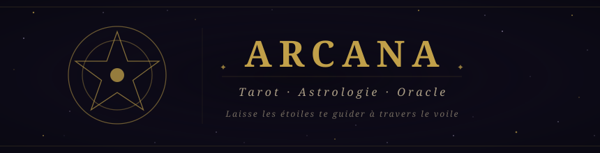

<div align="center">
  
</div>

<br />

<div align="center">

[](https://react.dev)
[](https://www.typescriptlang.org)
[](https://vitejs.dev)
[](https://www.framer.com/motion)
[](LICENSE)

</div>

---

## ✦ À propos

**Arcana** est une application de tirage de tarot et d'astrologie à l'esthétique occulte — sombre, mystique, théâtrale. Elle propose deux modes d'interprétation : des significations fixes soigneusement rédigées, ou un oracle IA qui génère des lectures poétiques via une Lambda AWS.

Pas une app utilitaire. Une expérience.

---

## ☽ Fonctionnalités

| ✦ | Fonctionnalité |
|---|---|
| **Tirage de cartes** | 1, 3 ou 5 cartes — tirage simple, passé/présent/futur, croix celtique |
| **78 cartes** | 22 Arcanes Majeurs + 56 Mineurs (Rider-Waite-Smith), endroit ou renversé |
| **Oracle IA** | Interprétations poétiques générées par une Lambda AWS (proxy IA) |
| **Lecture globale** | Vision d'ensemble d'un tirage multi-cartes tissée en un seul souffle |
| **Astrologie** | Lecture combinée signe zodiacal × carte tirée aléatoirement |
| **Fond étoilé** | Canvas animé avec étoiles scintillantes et 12 glyphes astrologiques dessinés à la main |
| **Animations** | Flip 3D des cartes, transitions de vue, stagger au tirage |

---

## ⬡ Stack technique

| Technologie | Rôle |
|---|---|
| **React 19 + React Compiler** | Mémoïsation automatique, zéro `useMemo` manuel |
| **TypeScript** | Typage strict, `verbatimModuleSyntax` |
| **Vite 6** | Build, HMR, résolution d'alias de chemins |
| **TanStack Router v1** | File-based routing, params type-safe, code splitting |
| **Framer Motion** | Flip 3D des cartes, `AnimatePresence`, transitions de vue |
| **SCSS Modules** | Styles scopés par composant, mixins partagés |
| **AWS Lambda + API Gateway** | Proxy oracle IA — pas de clé exposée côté client |
| **Canvas 2D** | Fond étoilé + glyphes astrologiques (aucune police, aucun emoji) |

---

## ✧ Mise en route

### Prérequis

- **Node.js** ≥ 20
- **pnpm** (recommandé) — `npm i -g pnpm`

### Installation

```bash
git clone https://github.com/<ton-user>/arcana.git
cd arcana
pnpm install
```

### Variables d'environnement

Crée un fichier `.env` à la racine (voir `.env.example`) :

```env
VITE_ORACLE_API_URL=https://<api-gateway-id>.execute-api.<region>.amazonaws.com
```

Sans cette variable, l'oracle IA est désactivé et les significations fixes sont affichées.

### Lancement

```bash
pnpm dev
```

L'app est disponible sur [http://localhost:5173](http://localhost:5173).

---

## ✦ Structure

```
src/
├── api/
│   └── oracle.ts            # Appels POST vers la Lambda AWS (card, spread, astro)
├── hooks/
│   └── useOracle.ts         # Hook oracle avec état loading/error/text
├── contexts/
│   └── oracle.context.ts    # OracleContext { aiEnabled }
├── data/                    # 78 cartes, 12 signes, labels de positions
├── models/                  # Interfaces TypeScript
├── styles/
│   └── _mixins.scss         # Mixins SCSS partagés
├── routes/                  # File-based routing TanStack Router
└── components/
    ├── StarField/            # Canvas étoilé + 12 glyphes planétaires
    ├── TarotCard/            # Carte avec flip 3D (Framer Motion)
    ├── CardModal/            # Popup carte + interprétation
    ├── InterpPanel/          # Panneau de lecture (astrologie)
    ├── TirageScreen/         # Écran principal — SpreadSelector + SpreadLayout
    ├── AstroScreen/          # Écran astrologie
    └── Sigil/                # Logo animé en SVG
```

---

## ☽ Oracle IA

Les lectures sont générées par un modèle IA via une **Lambda AWS** (proxy — aucune clé API exposée côté client).

Trois types de lectures :

- **Carte individuelle** — interprétation intime, position endroit ou renversée
- **Lecture globale** — vision d'ensemble tissée entre toutes les cartes du tirage
- **Astrologie** — lecture combinée signe × carte tirée aléatoirement

Sans `VITE_ORACLE_API_URL`, l'oracle est désactivé et les significations fixes sont affichées.

---

## ✦ Polices

Le projet utilise [Cinzel Decorative](https://fonts.google.com/specimen/Cinzel+Decorative) (titres) et [Crimson Pro](https://fonts.google.com/specimen/Crimson+Pro) (corps), chargées via Google Fonts.

> **Note GitHub** — Les polices personnalisées ne peuvent pas être chargées dans les SVG rendus par GitHub. Le bandeau ci-dessus utilise une police serif générique comme fallback. Ouvre [`assets/banner.svg`](assets/banner.svg) directement dans un navigateur pour le rendu complet.

---

<div align="center">
<br />

*✦ &nbsp; Que les arcanes t'éclairent &nbsp; ✦*

<br />
</div>
